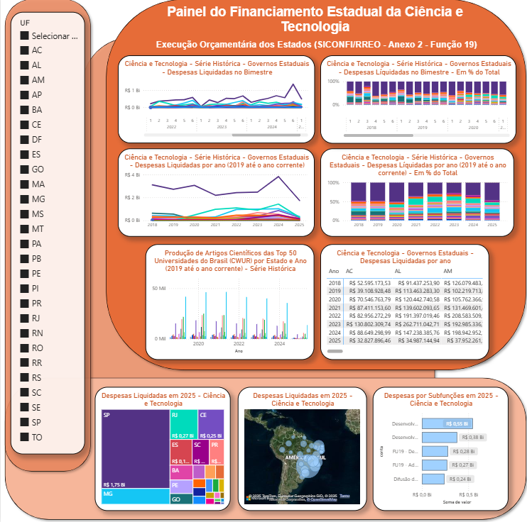

# Painel RREO – Ciência e Tecnologia (Função 19) e Produção Científica

Este projeto disponibiliza um **dashboard interativo em Power BI** para análise das **despesas da Função 19 (Ciência e Tecnologia)**, obtidas diretamente da **API do Tesouro Transparente (SICONFI)** por meio do endpoint `rreo`.  

Além disso, foram integrados **dados de produção científica** obtidos da **API OpenAlex**, permitindo **correlacionar investimentos públicos com a produção acadêmica (número de artigos científicos) por estado e por ano**.

---

## Escopo dos Dados

- O painel considera apenas as **despesas liquidadas**, com base no atributo: `coluna = "DESPESAS LIQUIDADAS ATÉ O BIMESTRE (d)"`.
- **Despesas intra-orçamentárias foram excluídas.**
- Foram filtradas apenas as **despesas da Função 19 - Ciência e Tecnologia** e as seguintes subfunções:
  - **571 – Desenvolvimento Científico**
  - **572 – Desenvolvimento Tecnológico e Engenharia**
  - **573 – Difusão do Conhecimento Científico e Tecnológico**
  - **FU19 – Demais Subfunções**
  - **FU19 – Administração Geral**

---


<p align="center">
  
  <br>
  <em>Figura 1 – Painel interativo em Power BI com dados de despesas liquidadas e produção científica por estado.</em>
</p>

---

## Destaques do Painel

- **Ciência e Tecnologia:** análise exclusiva dos gastos públicos classificados como Função 19, conforme a Classificação Funcional do **MTO 2026**.  
- **Produção Científica:** número de artigos publicados em periódicos (2019–Atual) das **Top 57 universidades brasileiras (CWUR)**.  
- **Comparativo entre Estados:** visualização e ranking de despesas e produção acadêmica.  
- **Correlação Investimento × Produção:** análise dos dados orçamentários com a produção científica anual por estado.  
- **Série Histórica (2018–Atual):** evolução dos indicadores em linha do tempo.  
- **Mapa Interativo:** visão geográfica das despesas, por estado, com **Ciência e Tecnologia** em **2025**.

---

## Coleta de Dados

### **Despesas Públicas (SICONFI)**
- **Endpoint:** `rreo` (API Tesouro Nacional - RREO Anexo 2).  
- **Filtros utilizados:**  
  - **`id_ente`**: Código IBGE do estado (ex: 33 = Rio de Janeiro);
  - **`an_referencia`**: Ano de referência (2018 até o atual);
  - **`nr_periodo`**: Bimestre (1 a 6);
  - **`co_tipo_demonstrativo`**: RREO (Relatório Resumido Execução Orçamentária);
  - **`no_anexo`**: `RREO-Anexo 02`;
  - **`coluna`**: `DESPESAS LIQUIDADAS ATÉ O BIMESTRE (d)`;
  - **`rotulo`**: `Total das Despesas Exceto Intra-Orçamentárias`;
  - **`conta`**: Função 19 (Ciência e Tecnologia) e subfunções associadas.

### **Produção Científica (OpenAlex)**
- **Endpoint:** `works` e `institutions`.  
- **Filtros utilizados:**  
  - **Instituições:** Top 57 universidades do Brasil (CWUR).  
  - **Tipo de publicação:** `type_crossref=journal-article`.  
  - **Período:** 2019 até o ano atual.  
  - **Outros filtros:** `is_paratext=false`, `primary_location.source.type=journal`.  

---

## Uso do Script R no Power BI

O projeto utiliza dois scripts principais:
- **`DoFile_FU19_Bimestral.R`**  
  Para extrair e organizar dados de execução orçamentária. A tabela resultante já é processada e estruturada para revelar o gasto total por bimestre de cada ano, para cada UF e especificamente na função 19 do MTO e suas subfunções associadas.
- **`DoFile_OpenAlex_Artigos.R`**  
  Para extrair e consolidar o número de artigos científicos por universidade, estado e ano.

Ambos os scripts geram arquivos `.csv` prontos para importação no Power BI:
- `ciencia_tec_liquidadas_bimestrais.csv` (com gastos totais por bimestre, por ente e por ano, na função 19 do MTO)
- `top50_universidades_ano_estado.csv` (com dados de artigos científicos).

---

## Alternativa Rápida: CSV Pré-Gerado

O repositório inclui arquivos `.csv` pré-processados:
- **Despesas:** `ciencia_tec_liquidadas_bimestrais.csv`
- **Artigos Científicos:** `top50_universidades_ano_estado.csv`

Esses arquivos permitem carregar rapidamente os dados no Power BI via **Obter Dados > Texto/CSV**.

## Estrutura do Projeto

```text
POWERBI-CIENCIA-TECNOLOGIA-SICONFI/
│
├── data/
│   ├── raw/                               # dumps brutos da API (para reprocessar quando quiser)
│   │   └── siconfi_rreo_bruto_2015_2025.csv
│   └── processed/                         # tabelas prontas para o Power BI
│       ├── ciencia_tec_liquidadas_bimestrais.csv
│       ├── estados.csv
│       └── top50_universidades_ano_estado.csv
│
├── docs/                                  # documentação e imagens
│   ├── data-dictionary.md
│   └── demo.png
│
├── src/                                   # scripts R
│   ├── DoFile_FU19_Bimestral.R            # coleta RREO/Anexo 02 e gera a tabela bimestral (Função 19)
│   └── DoFile_OpenAlex_Artigos.R          # coleta OpenAlex (artigos por estado/ano)
│
├── Dashboard de Ciência e Tecnologia.pbix  # arquivo do Power BI
├── .gitignore
└── README.md
```
